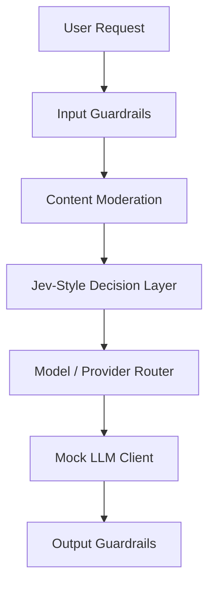

# Jev LLM Router With Guardrails

Small runnable project showing how a Jev-style typed decision layer can route an LLM request to a high, medium, or low cost/performance model/provider based on intent, content risk, context length, confidentiality, and safety policy.

This project uses a local `JevDecisionLayer` adapter so it runs without private TypeSafe AI credentials. The adapter is intentionally shaped like a real Jev integration: unstructured request state goes in, typed choices with probabilities and confidence come out.

## What It Demonstrates

- Intent-aware model routing: code, security, data analysis, summarization, casual chat, and sensitive advice.
- Provider selection: high, medium, low, and self-hosted/local routes.
- Content moderation before model execution.
- Input guardrails for prompt injection, secret leakage, and oversized requests.
- Output guardrails for secret redaction and unsafe content checks.
- LLM fallback behavior when the decision confidence is low.

## Architecture



## Run

```bash
npm run demo
```

Run one custom prompt:

```bash
node src/index.js "Summarize this incident report for an executive audience"
```

Run tests:

```bash
npm test
```

## Example Routing Policy

| Intent / Content | Route |
| --- | --- |
| Simple summary or casual question | Low cost model |
| Data analytics or structured reasoning | Medium model |
| Code generation, security analysis, or low-confidence decision | High capability model |
| Confidential customer or internal content | Self-hosted/local provider |
| Unsafe or policy-violating request | Block before LLM call |

## Where Jev Fits

Jev is treated as the fast typed decision layer, not as the text generator. It decides bounded choices such as:

- `intent`
- `riskLevel`
- `confidentiality`
- `routeTier`
- `provider`
- `allowRequest`

Then the selected LLM handles only the generation task.

To replace the local adapter with a real Jev call, update `src/jevDecisionLayer.js` and preserve the returned decision shape used by `src/router.js`.

## Sample Decision

```json
{
  "allowRequest": true,
  "intent": "security_analysis",
  "riskLevel": "medium",
  "confidentiality": "internal",
  "routeTier": "high",
  "provider": "openai",
  "model": "gpt-5.1",
  "confidence": 0.91
}
```

