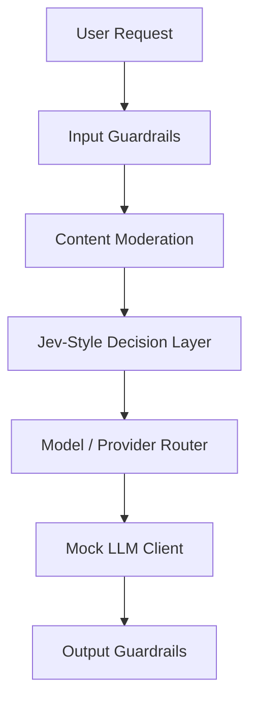

# Jev LLM Router With Guardrails

Production-shaped project showing how a Jev-style typed decision layer can route an LLM request to a high, medium, or low cost/performance model/provider based on intent, content risk, context length, confidentiality, and safety policy.

This project uses a local `JevDecisionLayer` adapter so it runs without private TypeSafe AI credentials. The adapter is intentionally shaped like a real Jev integration: unstructured request state goes in, typed choices with probabilities and confidence come out.

## What It Demonstrates

- Intent-aware model routing: code, security, data analysis, summarization, casual chat, and sensitive advice.
- Provider selection: high, medium, low, and self-hosted/local routes.
- Content moderation before model execution.
- Input guardrails for prompt injection, secret leakage, and oversized requests.
- Output guardrails for secret redaction and unsafe content checks.
- LLM fallback behavior when the decision confidence is low.
- HTTP API with health, metrics, route, and audit endpoints.
- Config-driven routing policy.
- Provider registry abstraction for hosted and self-hosted models.
- Structured JSON logs, in-memory metrics, and audit events.
- CI workflow and Dockerfile.

## Architecture



For the full service design, see [docs/ARCHITECTURE.md](docs/ARCHITECTURE.md).

## Run

```bash
npm run demo
```

Run one custom prompt:

```bash
node src/index.js "Summarize this incident report for an executive audience"
```

Run tests:

```bash
npm test
```

## Run As A Service

```bash
cp .env.example .env
npm run serve
```

By default, local runs bind to `127.0.0.1:8080`. For containers, the Dockerfile sets `HOST=0.0.0.0`.

Health check:

```bash
curl http://localhost:8080/healthz
```

Route a request:

```bash
curl -X POST http://localhost:8080/v1/route \
  -H "content-type: application/json" \
  -d '{"prompt":"Analyze this internal source code vulnerability report and choose the safest model route."}'
```

Metrics:

```bash
curl http://localhost:8080/metrics
```

Recent audit events:

```bash
curl http://localhost:8080/audit
```

## Docker

```bash
docker build -t jev-llm-router .
docker run --rm -p 8080:8080 jev-llm-router
```

## Example Routing Policy

| Intent / Content | Route |
| --- | --- |
| Simple summary or casual question | Low cost model |
| Data analytics or structured reasoning | Medium model |
| Code generation, security analysis, or low-confidence decision | High capability model |
| Confidential customer or internal content | Self-hosted/local provider |
| Unsafe or policy-violating request | Block before LLM call |

## Where Jev Fits

Jev is treated as the fast typed decision layer, not as the text generator. It decides bounded choices such as:

- `intent`
- `riskLevel`
- `confidentiality`
- `routeTier`
- `provider`
- `allowRequest`

Then the selected LLM handles only the generation task.

To replace the local adapter with a real Jev call, update `src/jevDecisionLayer.js` and preserve the returned decision shape used by `src/router.js`.

The production contract is owned by `src/harness.js`, which returns:

- `requestId`
- sanitized input and guardrail violations
- moderation verdict
- typed Jev-style decision
- selected provider/model metadata
- guarded output
- telemetry

## Sample Decision

```json
{
  "allowRequest": true,
  "intent": "security_analysis",
  "riskLevel": "medium",
  "confidentiality": "internal",
  "routeTier": "high",
  "provider": "openai",
  "model": "gpt-5.1",
  "confidence": 0.91
}
```

## Project Structure

```text
config/policy.json              Routing and guardrail policy
src/harness.js                  Production request lifecycle
src/server.js                   HTTP API
src/jevDecisionLayer.js         Jev-style typed decision adapter
src/providers/                  Provider registry and provider clients
src/observability/              Logs and metrics
src/audit/                      Recent audit events
test/                           Node test suite
```
