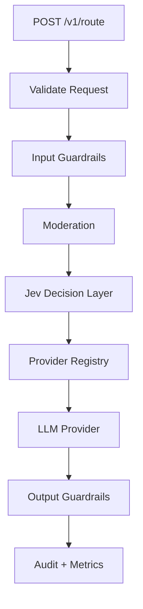

# Architecture

JEV-AS-LLM is structured as a control-plane harness for LLM applications. The LLM is still responsible for generation, while the Jev-style decision layer handles bounded decisions that should be fast, typed, auditable, and policy-aware.

## Request Lifecycle

## Core Components

| Component | Responsibility |
| --- | --- |
| `JevLlmHarness` | Owns the full request lifecycle and response contract. |
| `JevDecisionLayer` | Returns typed decisions such as intent, risk, route tier, provider, confidence, and allow/block. |
| `ProviderRegistry` | Maps a decision to the provider client that will execute generation. |
| `guardrails.js` | Detects prompt injection, secrets, oversized inputs, and unsafe output. |
| `moderation.js` | Blocks high-severity unsafe requests before model execution. |
| `policy.json` | Central configuration for routing, provider availability, confidence thresholds, and guardrails. |
| `metrics.js` | Tracks request counts, block counts, provider usage, tier usage, and latency. |
| `auditLog.js` | Keeps recent decision events for debugging and governance. |

## Production Integration Points

- Replace the local decision implementation in `src/jevDecisionLayer.js` with a hosted Jev API call.
- Replace the mock provider in `src/providers/providerRegistry.js` with real OpenAI, Anthropic, Google, OpenRouter, or vLLM clients.
- Send metrics to Prometheus, Datadog, CloudWatch, or OpenTelemetry.
- Persist audit events to a database or append-only log.
- Add authentication and tenant-aware rate limits at the API gateway layer.
